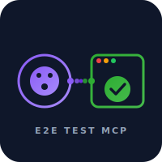
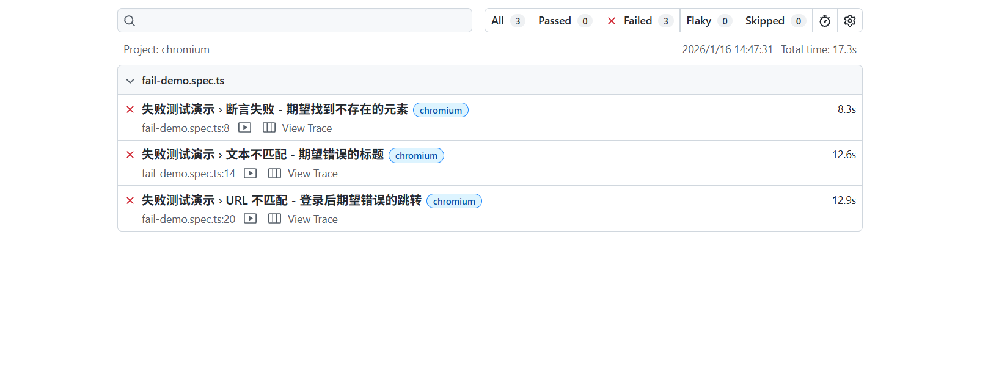
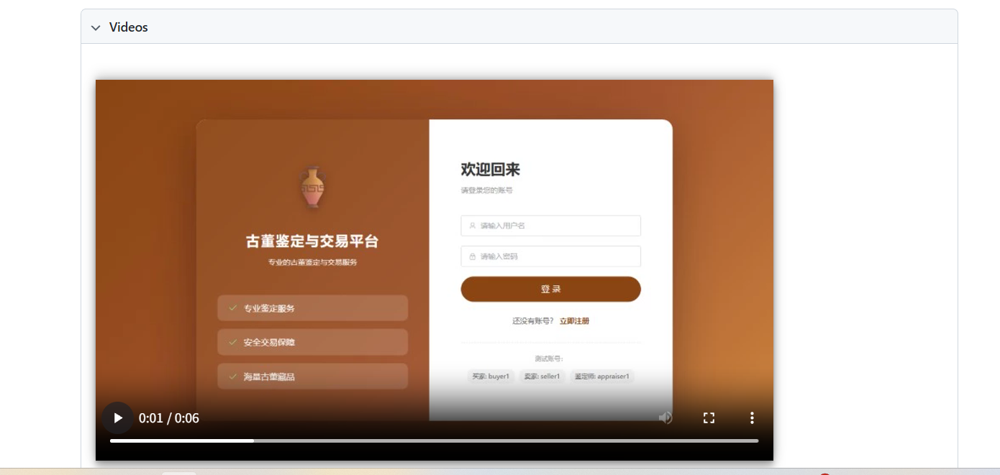
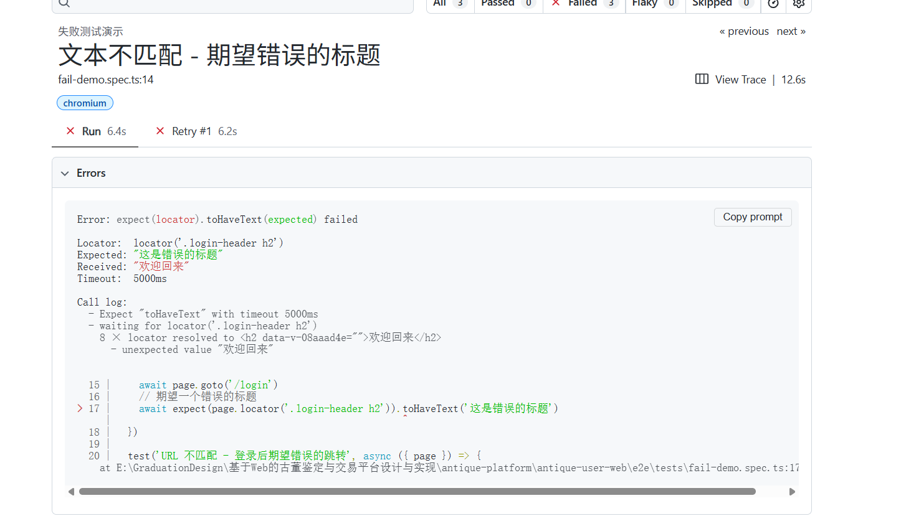

<p align="center">
  
</p>

<h1 align="center">E2E Test MCP Server 🎭</h1>

<p align="center">
  <strong>让 AI 助手自动编写和执行 E2E 测试</strong><br>
  <sub>基于 Playwright · 支持主流 UI 框架 · 智能错误修复</sub>
</p>

<p align="center">
  <a href="https://www.npmjs.com/package/e2e-test-mcp"></a>
  <a href="https://opensource.org/licenses/MIT"></a>
  <a href="https://nodejs.org/"></a>
</p>

<p align="center">
  <a href="#-快速开始">快速开始</a> · 
  <a href="#-效果演示">效果演示</a> · 
  <a href="#%EF%B8%8F-工具">工具</a> · 
  <a href="docs/README.md">文档</a>
</p>

---

## ✨ 特性

- 🚀 **一句话生成测试** — 告诉 AI "帮我测试登录页面"，自动完成全部工作
- 🔧 **智能错误修复** — 测试失败后 AI 自动分析并修复脚本
- 🎨 **框架无关** — 支持 Element Plus、Ant Design、MUI 等主流 UI 框架
- 📊 **可视化报告** — 自动生成 HTML 测试报告，失败截图一目了然
- 🧠 **内置最佳实践** — 提供运行时 DOM 知识，引导 AI 使用稳定选择器

## 🎬 效果演示

<details>
<summary><b>1️⃣ 初始化项目 & 生成测试脚本</b></summary>
<br>
<p align="center">
  
</p>
</details>

<details>
<summary><b>2️⃣ 智能修复配置</b></summary>
<br>
<p align="center">
  
</p>
</details>

<details>
<summary><b>3️⃣ 自动修复失败测试</b></summary>
<br>
<p align="center">
  
</p>
</details>

<details>
<summary><b>4️⃣ 查看测试结果</b></summary>
<br>
<p align="center">
  
</p>
</details>

<details>
<summary><b>5️⃣ 测试详情报告</b></summary>
<br>
<p align="center">
  
</p>
</details>

<details>
<summary><b>6️⃣ 测试失败列表</b></summary>
<br>
<p align="center">
  
</p>
</details>

<details>
<summary><b>7️⃣ 失败详情（截图 & 录屏）</b></summary>
<br>
<p align="center">
  
</p>
<p align="center">
  
</p>
</details>

## 🚀 快速开始

### 方式一：直接使用（推荐）

无需手动克隆，npx 直接从 GitHub 运行：

```json
{
  "mcpServers": {
    "e2e-test": {
      "command": "npx",
      "args": ["-y", "github:wjj9868/e2e-mcp-server"]
    }
  }
}
```

### 方式二：克隆仓库

```bash
git clone https://github.com/wjj9868/e2e-mcp-server.git
cd e2e-mcp-server
npm install
npm run build
```

```json
{
  "mcpServers": {
    "e2e-test": {
      "command": "node",
      "args": ["/path/to/e2e-mcp-server/dist/index.js"]
    }
  }
}
```

### 配置位置

<details>
<summary><b>Claude Desktop</b></summary>

- macOS: `~/Library/Application Support/Claude/claude_desktop_config.json`
- Windows: `%APPDATA%\Claude\claude_desktop_config.json`
</details>

<details>
<summary><b>Kiro</b></summary>

`.kiro/settings/mcp.json`
</details>

<details>
<summary><b>Cursor</b></summary>

在 Cursor 设置中添加 MCP 服务器配置
</details>

### 开始使用

只需告诉 AI：

```
帮我为登录页面写 E2E 测试
```

AI 会自动完成：初始化项目 → 分析源码 → 生成测试 → 执行测试 → 修复问题

## 🛠️ 工具

| 工具 | 说明 |
|------|------|
| `e2e_init` | 初始化 Playwright 测试项目 |
| `e2e_run` | 执行测试并返回结构化结果 |
| `e2e_report` | 打开 HTML 测试报告 |

## � 提示词

| 提示词 | 说明 |
|--------|------|
| `e2e-context` | 运行时 DOM 结构、选择器策略、Playwright API |
| `e2e-debug` | 测试失败排查指南 |

## 🎨 支持的 UI 框架

<table>
<tr>
<td align="center"><b>Element Plus</b><br><sub>Vue 3</sub></td>
<td align="center"><b>Ant Design Vue</b><br><sub>Vue 3</sub></td>
<td align="center"><b>Ant Design</b><br><sub>React</sub></td>
<td align="center"><b>MUI</b><br><sub>React</sub></td>
<td align="center"><b>Chakra UI</b><br><sub>React</sub></td>
</tr>
</table>

## 💭 设计理念

> **MCP 只做 AI 做不了的事**

| AI 负责 | MCP 负责 |
|---------|----------|
| 分析源码 | 初始化项目 |
| 设计测试场景 | 执行测试 |
| 生成测试代码 | 提供运行时 DOM 知识 |
| 修复失败测试 | 生成测试报告 |

传统方案用模板约束 AI，限制了 AI 的能力。本项目让 AI 充分发挥代码理解和生成能力，MCP 只提供 AI 无法自己推断的运行时信息。

## 📖 文档

| 文档 | 说明 |
|------|------|
| [快速开始](docs/getting-started.md) | 5 分钟上手 |
| [选择器策略](docs/selectors.md) | 编写稳定的测试 |
| [UI 框架指南](docs/ui-frameworks.md) | 各框架 DOM 特点 |
| [调试指南](docs/debugging.md) | 测试失败排查 |
| [常见问题](docs/faq.md) | FAQ |

## 📋 环境要求

- Node.js >= 18.0.0
- Playwright（通过 `e2e_init` 自动配置）

## 🤝 贡献

欢迎提交 [Issue](https://github.com/wjj9868/e2e-mcp-server/issues) 和 [Pull Request](https://github.com/wjj9868/e2e-mcp-server/pulls)！

## 📄 License

[MIT](LICENSE) © [wjj9868](https://github.com/wjj9868)
