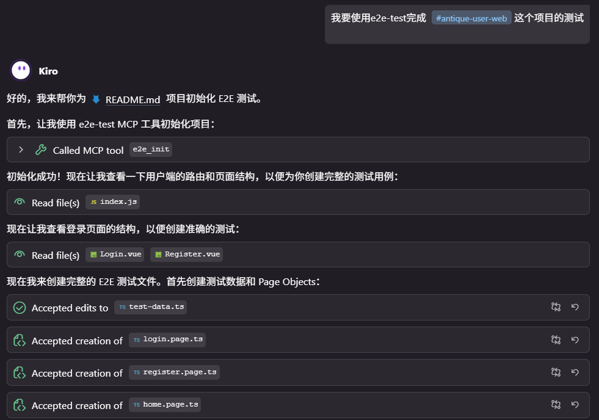
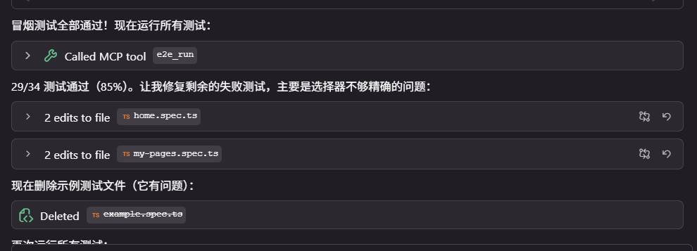
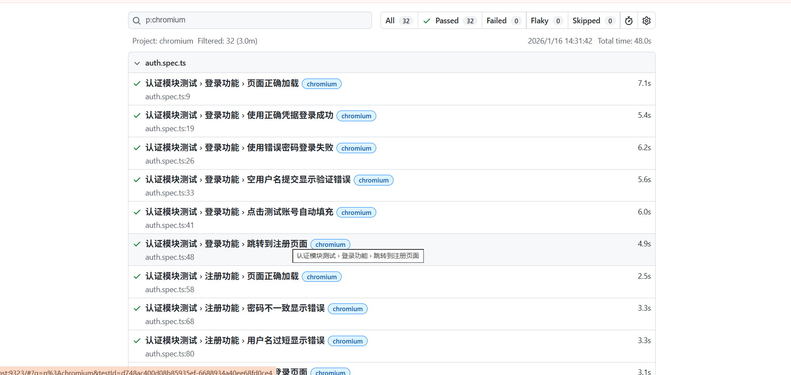
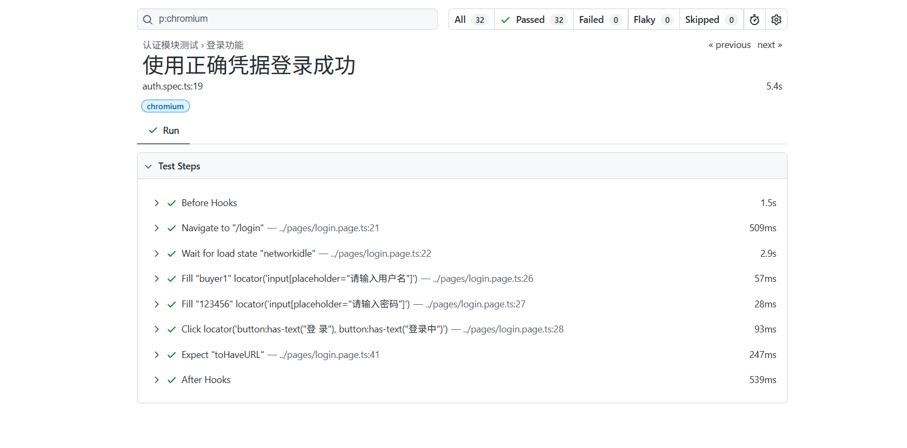

# E2E Test MCP Server 文档

## 目录

- [快速开始](./getting-started.md)
- [选择器策略](./selectors.md)
- [UI 框架指南](./ui-frameworks.md)
- [调试指南](./debugging.md)
- [常见问题](./faq.md)

## 概述

E2E Test MCP Server 是一个专为 AI 助手设计的 MCP 服务，基于 Playwright 提供 E2E 测试能力。

### 核心特点

- **基于 Playwright** — 业界领先的 E2E 测试框架
- **框架无关** — 支持 Element Plus、Ant Design、MUI 等主流 UI 框架
- **智能选择器** — 引导 AI 使用稳定选择器，避免动态 ID
- **自动修复** — AI 可根据测试结果自动修复脚本

## 工作流程演示

### 1. 初始化 & 生成测试

MCP 工具初始化 E2E 目录，AI 分析项目并生成测试脚本：



### 2. 智能修复配置

根据项目实际运行端口自动修复配置：


### 3. 自动修复失败测试

脚本出错后，AI 自动分析并修复：



### 4. 测试结果

查看整体测试结果：



### 5. 详细报告

查看单条测试详情：



## 架构

```
┌─────────────────────────────────────────────────────┐
│                    AI 助手                           │
│  ┌─────────────┐  ┌─────────────┐  ┌─────────────┐  │
│  │  分析源码   │  │  设计测试   │  │  生成代码   │  │
│  └─────────────┘  └─────────────┘  └─────────────┘  │
└─────────────────────────┬───────────────────────────┘
                          │ MCP 协议
┌─────────────────────────▼───────────────────────────┐
│              E2E Test MCP Server                     │
│  ┌─────────────┐  ┌─────────────┐  ┌─────────────┐  │
│  │  e2e_init   │  │  e2e_run    │  │  e2e_report │  │
│  │  初始化项目 │  │  执行测试   │  │  查看报告   │  │
│  └─────────────┘  └─────────────┘  └─────────────┘  │
└─────────────────────────┬───────────────────────────┘
                          │
┌─────────────────────────▼───────────────────────────┐
│                   Playwright                         │
│              浏览器自动化引擎                         │
└─────────────────────────────────────────────────────┘
```

## 设计理念

传统 E2E 测试工具试图用模板约束 AI，这限制了 AI 的能力。

本项目采用不同的方法：

1. **AI 擅长的交给 AI** — 代码分析、测试设计、代码生成、错误修复
2. **MCP 只做必要的事** — 执行测试、提供运行时 DOM 知识

这种分工让 AI 能充分发挥其代码理解和生成能力，同时通过 MCP 获取它无法自己推断的运行时信息。

## 下一步

- [快速开始](./getting-started.md) — 5 分钟上手
- [选择器策略](./selectors.md) — 编写稳定的测试
